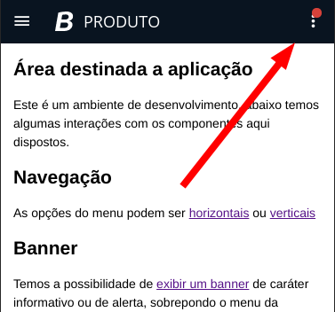

# Como contribuir

Os componentes foram desenvolvidos utilizando tecnologia de [**Web Components**](https://www.webcomponents.org/introduction) através do [**StencilJS**](http://stenciljs.com/).

## Ferramentas

Abaixo estão as ferramentas utilizadas e as versões recomendadas.

- [**Node.js**](https://nodejs.org/en/) `v12.17` ou posterior
- [**yarn**](https://classic.yarnpkg.com/en/) `v1.22` ou posterior

## Comandos

Lista de alguns comandos úteis para terminal

- `yarn` Instalar as dependências
- `yarn start` Inicializar servidor de desenvolvimento dos componentes e acessar através do browser em [http://localhost:3333](http://localhost:3333)
- `yarn build` Gerar arquivos para distribuição e documentações automáticas
- `yarn test` Irá executar toda a suíte de testes unitários e _end-to-end_
- `yarn test.watch` Irá manter em observação os arquivos de testes para executá-los caso haja alteração (é bom para desenvolver cenários de testes)
- `yarn lint` Irá exibir um relatório com alertas e possíveis erros de escrita de código

## Novos componentes

Basta digitar `yarn generate` no terminal e seguir o passo a passo conforme solicitado.

1. Por convenção, novos elementos devem possuir o prefixo `bth-` em suas tags.
2. Este prefixo **não** deve estar presente nos nomes de classes/arquivos, somente nas tags.

## Testes

O Stencil provê um ferramental para testes unitários (com [**Jest**](https://jestjs.io/)) e de integração (com [**Puppeteer**](https://pptr.dev/)).

Abaixo temos algumas documentações de referências.

- [Stencil Testing Overview](https://stenciljs.com/docs/testing-overview)
- [The Basics of Unit Testing in StencilJS - Josh Morony](https://www.joshmorony.com/the-basics-of-unit-testing-in-stencil-js/)
- [Jest.js Docs](https://jestjs.io/docs/en/getting-started)
- [Puppeteer Docs](https://pptr.dev/)
- [JavaScript Testing Introduction Tutorial - Unit Tests, Integration Tests & e2e Tests](https://youtu.be/r9HdJ8P6GQI)

A extensão [**Coverage Gutters para Visual Studio Code**](https://marketplace.visualstudio.com/items?itemName=ryanluker.vscode-coverage-gutters) pode ser utilizada para visualizar a cobertura por arquivo

### Abordagem para escrita dos testes

É importante que os testes sejam pequenos e isolados, no intuito de testar um cenário bem específico.

A abordagem abaixo, organiza em 3 etapas um teste e é sugerida para a elaboração de novos cenários:

```ts
describe('descrição de um grupo de cenários de testes', () => {
  
  it('descrição do cenário que será testado', async () => {
    // 1. Organizar (Arrange): prepara-se o ambiente, dependências e componentes, configurando o estado necessário para o teste.

    // 2. Atuar (Act): executar o código que terá seu comportamento testado

    // 3. Verificar (Assert): verificar se o resultado esperado foi atingido, indicando se o teste passou ou não
  });

})
```

## Características visuais e comportamentais

As características visuais e comportamentais devem ser respeitadas

1. Estar de acordo com o [Design System](https://design.plataforma.betha.cloud/)
1. Componentes do menu de ferramentas devem ser responsivos, adequando-se ao formato para dispositivos móveis.

## Style Guide e Boas Práticas

Abaixo segue algumas definições a fim de padronizar o projeto como um todo e algumas referências externas.

- [Stencil - Style Guide](https://stenciljs.com/docs/style-guide)

### Nomenclatura de `<slot />`

Havendo a necessidade de criação de _named slots_ sugere-se um padrão de escrita com letra minúscula separando palavras por _underline_, assim diferenciamos do estilo de escrita das classes CSS e de tags HTML.

Ex: `container_aplicacao`, `menu_ferramentas`, `corpo_painel_lateral`, etc

### Nomenclatura de Eventos

Sugere-se utilizar `camelCased`, seguindo [exemplos da documentação do Stencil](https://stenciljs.com/docs/events).

Sempre que possível utilizar nomenclatura no _passado_.

Ex: `componenteConectado`, `conteudoAdquirido`, `acaoRealizada`

## APIs

### Ferramentas do menu que possuem indicador de pendência

Os componentes que comportam o _slot_ de ferramentas do menu, podem possuir indicadores visuais _(badges)_ que indicam pendências ao usuaŕio. 

Estes componentes, devem implementar a comunicação com o [`bth-app`](./src/app) através de eventos do DOM que permite que a estrutura saiba que há componentes com pendências, podendo assim exibir o indicador abaixo para dispositos móveis.



Através do evento `conteudoSinalizado` é possível informar qual a origem e se possui ou não conteúdo sinalizado pendente de leitura.

Os componentes [`bth-notificacoes`](./src/components/notificacoes) e o [`bth-novidades`](./src/components/novidades) podem servir de referência de implementação deste recurso.

## Referências

### Web Components

O Stencil possui um ferramental para auxiliar na construção de componentes que atendem às [específicações de Web Components](https://www.webcomponents.org/specs)

- [Shadow DOM @ MDN Docs](https://developer.mozilla.org/en-US/docs/Web/Web_Components/Using_shadow_DOM)
- [CSS Custom Properties @ MDN Docs](https://developer.mozilla.org/en-US/docs/Web/CSS/Using_CSS_custom_properties)
- [Slot @ MDN Docs](https://developer.mozilla.org/en-US/docs/Web/HTML/Element/slot)
- [axe-coconut - Web Acessibility Testing for Web Components](https://chrome.google.com/webstore/detail/axe-coconut-web-accessibi/iobddmbdndbbbfjopjdgadphaoihpojp)

### Stencil

- [Stencil - Stencil is a toolchain for building reusable, scalable Design Systems](https://stenciljs.com)
- [Stencil - Resources](https://stenciljs.com/resources)