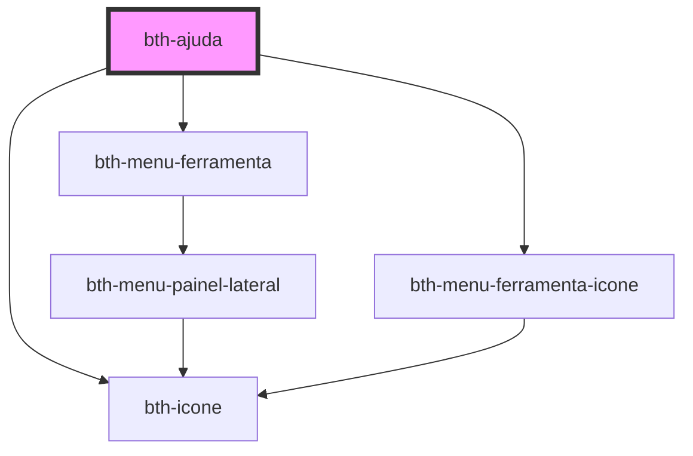

# bth-ajuda

Este componente permite acessar a central de ajuda.

Foi projetado para comportar a área das ferramentas, através do slot "menu_ferramentas".

## Requisitos

### Variáveis

- Ter o `envs.js` sendo importado ou configurar as variáveis através do [customizando URL](#customizando-url)

## HTML

A tag do componente é `<bth-ajuda>` e através do atributo `slot` é possível direcionar o componente para **menu_ferramentas**.

```html
<bth-app>

  <!-- ... -->
  <bth-ajuda slot="menu_ferramentas"><bth-ajuda>
  <!-- ... -->

</bth-app>
```

### Customizando URL

A configuração é necessária somente caso haja necessidade de informar a url da central manualmente (situações onde não se utiliza o `env.js`)

<!-- Auto Generated Below -->


## Properties

| Property           | Attribute            | Description                                                         | Type     | Default     |
| ------------------ | -------------------- | ------------------------------------------------------------------- | -------- | ----------- |
| `centralAjudaHome` | `central-ajuda-home` | URL para a home da central de ajuda. Por padrão irá obter do env.js | `string` | `undefined` |


## Dependencies

### Depends on

- [bth-menu-ferramenta](../app/menu-ferramenta)
- [bth-menu-ferramenta-icone](../app/menu-ferramenta-icone)
- [bth-icone](../comuns/icone)

### Graph


----------------------------------------------

Esta documentação é gerada automáticamente pelo StencilJS =)
