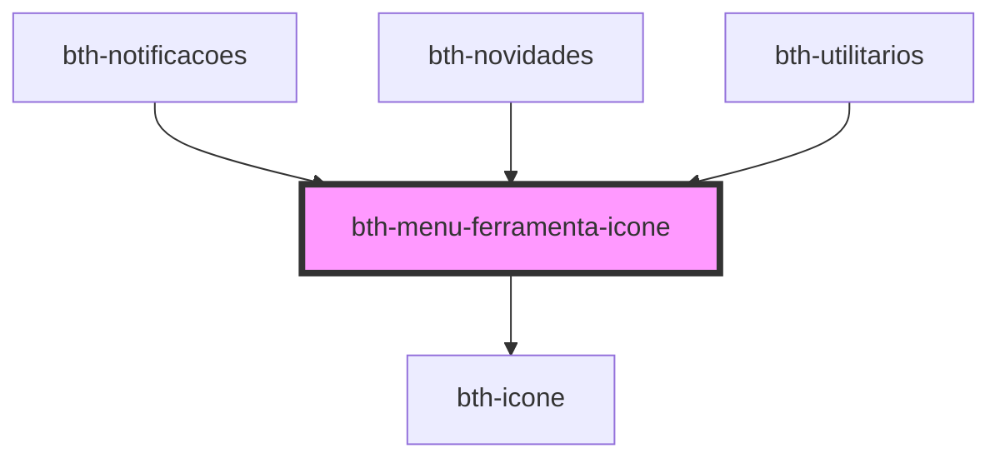

# bth-menu-ferramenta-icone

Abstrai a estilização de um ícone para `menu-ferramenta`.

Também implementa a possibilidade de exibição de um `badge` ao lado do ícone, através da propriedade `contador`.

## Exemplo

> _Snippet_ retirado do componente de [Notificações](../../notificacoes)

```html
<bth-menu-ferramenta-icone slot="menu_item_mobile" icone="bell" contador="37" mobile></bth-menu-ferramenta-icone>
<span slot="menu_descricao_mobile" class="descricao-mobile">Notificações</span>

<bth-menu-ferramenta-icone slot="menu_item_desktop" icone="bell" contador="37"></bth-menu-ferramenta-icone>
```

<!-- Auto Generated Below -->


## Properties

| Property   | Attribute  | Description                                                 | Type      | Default   |
| ---------- | ---------- | ----------------------------------------------------------- | --------- | --------- |
| `contador` | `contador` | Valor que será exibido em uma "badge" próximo ao ícone      | `number`  | `0`       |
| `icone`    | `icone`    | Ícone conforme biblioteca `"Material Design Icons"`         | `string`  | `'cloud'` |
| `mobile`   | `mobile`   | Define se a estilização é "mobile". Por padrão é "desktop". | `boolean` | `false`   |


## Dependencies

### Used by

 - [bth-notificacoes](../../notificacoes)
 - [bth-novidades](../../novidades)
 - [bth-utilitarios](../../utilitarios)

### Depends on

- [bth-icone](../../comuns/icone)

### Graph


----------------------------------------------

Esta documentação é gerada automáticamente pelo StencilJS =)
