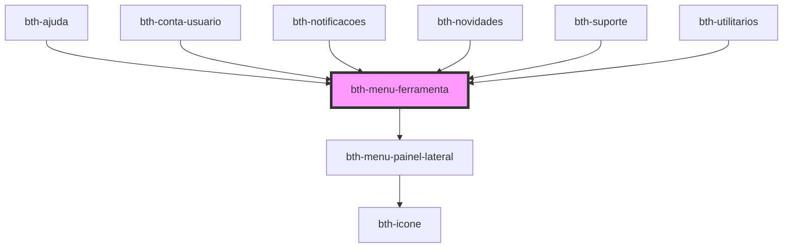

# bth-menu-ferramenta

Facilita a criação de Ferramentas para o menu. Abstrai comportamentos responsivos e controle do painel lateral.

## HTML

A tag do componente é `bth-menu-ferramenta` e suporta qualquer conteúdo sobre suas tags

```html
<bth-menu-ferramenta descricao="Ajuda" titulo-painel-lateral="Como podemos ajudar?">
  <bth-icone slot="menu_item_desktop" icone="help-circle"></bth-icone>

  <bth-icone slot="menu_item_mobile" icone="help-circle"></bth-icone>
  <span slot="menu_descricao_mobile">Lorem</span>

  <div slot="conteudo_painel_lateral" class="empty-ajuda">
    <h4>Lorem ipsum</h4>
    <p>Lorem ipsum dolor</p>
  </div>
</bth-menu-ferramenta>
```

## Possibilidades

Ferramenta disponível para desktop e mobile com painel lateral

```html
<bth-menu-ferramenta slot="menu_ferramentas" descricao="Contatos" titulo-painel-lateral="Abaixo sua lista de contatos">
  <i slot="menu_item_desktop" class="mdi mdi-account-search-outline" aria-hidden="true"></i>
  <i slot="menu_item_mobile" class="mdi mdi-account-search-outline" aria-hidden="true"></i>

  <span slot="menu_descricao_mobile" class="descricao-mobile">Contatos</span>

  <span slot="conteudo_painel_lateral">Corpo do painel de contatos</span>
</bth-menu-ferramenta>
```

Ferramenta somente para dispositivos móveis

```html
<bth-menu-ferramenta slot="menu_ferramentas" descricao="Dispositivos sem acesso">
  <i slot="menu_item_mobile" class="mdi mdi-cellphone-lock" aria-hidden="true"></i>

  <span slot="menu_descricao_mobile" class="descricao-mobile">Dispositivos sem acesso</span>

  <span slot="conteudo_painel_lateral">Corpo do painel de dispositivos sem acesso</span>
</bth-menu-ferramenta>
```

Ferramenta com avatar para dispositivos desktop

```html
<bth-menu-ferramenta slot="menu_ferramentas" descricao="Tecnologia">
  <bth-avatar slot="menu_item_desktop" tamanho="menor" imagem="https://placeimg.com/24/24/tech" borda borda-raio="50%" borda-tamanho="2px"></bth-avatar>
  <span slot="conteudo_painel_lateral">Corpo do painel de tecnologia</span>
</bth-menu-ferramenta>
```

Ferramenta com input qualquer formando campo de pesquisa

```html
<bth-menu-ferramenta slot="menu_ferramentas" descricao="Pesquisa">
  <input slot="menu_item_desktop" type="text" class="form-control form-control-sm" placeholder="Pesquisar"/>
</bth-menu-ferramenta>
```

As possibilidades são infinitas =)

<!-- Auto Generated Below -->


## Properties

| Property              | Attribute               | Description              | Type     | Default     |
| --------------------- | ----------------------- | ------------------------ | -------- | ----------- |
| `descricao`           | `descricao`             | Descrição                | `string` | `''`        |
| `tituloPainelLateral` | `titulo-painel-lateral` | Título do Painel Lateral | `string` | `undefined` |


## Methods

### `fecharPaineisAbertos() => Promise<void>`

Fecha os paineis abertos

#### Returns

Type: `Promise<void>`


## Slots

| Slot                        | Description                      |
| --------------------------- | -------------------------------- |
| `"conteudo_painel_lateral"` | Conteúdo do painel lateral       |
| `"menu_descricao_mobile"`   | Descrição para versão mobile     |
| `"menu_item_desktop"`       | Item do menu para versão desktop |
| `"menu_item_mobile"`        | Item do menu para versão mobile  |


## Dependencies

### Used by

 - [bth-ajuda](../../ajuda)
 - [bth-conta-usuario](../../conta-usuario)
 - [bth-notificacoes](../../notificacoes)
 - [bth-novidades](../../novidades)
 - [bth-suporte](../../suporte)
 - [bth-utilitarios](../../utilitarios)

### Depends on

- [bth-menu-painel-lateral](../menu-painel-lateral)

### Graph


----------------------------------------------

Esta documentação é gerada automáticamente pelo StencilJS =)
