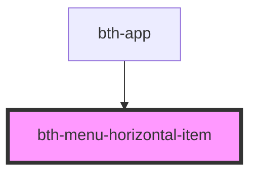

# menu-horizontal-item

Item que representa uma opção do menu para navegação horizontal

<!-- Auto Generated Below -->

## Properties

| Property          | Attribute          | Description                                                   | Type               | Default            |
| ----------------- | ------------------ | ------------------------------------------------------------- | ------------------ | ------------------ |
| `ativo`           | `ativo`            | Está ativo?                                                   | `boolean`          | `undefined`        |
| `contador`        | `contador`         | Contador  Exibe o valor inforamdo em um badge próximo ao menu | `number`           | `undefined`        |
| `descricao`       | `descricao`        | Descrição                                                     | `string`           | `undefined`        |
| `identificador`   | `identificador`    | Identificador                                                 | `number \| string` | `undefined`        |
| `possuiPermissao` | `possui-permissao` | Possui permissão?                                             | `boolean`          | `PERMISSAO_PADRAO` |

## Events

| Event                       | Description                           | Type                                          |
| --------------------------- | ------------------------------------- | --------------------------------------------- |
| `menuHorizontalSelecionado` | É emitido quando o menu é selecionado | `CustomEvent<MenuHorizontalSelecionadoEvent>` |

## Dependencies

### Used by

 - [bth-app](..)

### Graph

----------------------------------------------

Esta documentação é gerada automáticamente pelo StencilJS =)
