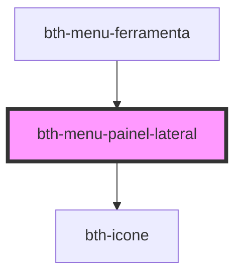

# bth-menu-painel-lateral

Possibilita incluir conteúdo dinâmico em um painel lateral que sobrepõe o conteúdo da tela pela direita

## HTML

A tag do componente é `<bth-menu-painel-lateral>` e suporta qualquer conteúdo sobre suas tags

```html
<bth-menu-painel-lateral show="true">
  <h1>Hello, World!</h1>
  <p>Lorem ipsum</p>
</bth-menu-painel-lateral>
```

## Controlando Exibição

Através do seu atributo "show" podemos controlar se está aberto ou fechado.

```js
const painelLateralEl = this.el.shadowRoot.querySelector('bth-menu-painel-lateral');
painelLateralEl.toggleAttribute('show');
```

<!-- Auto Generated Below -->


## Properties

| Property | Attribute | Description                          | Type      | Default     |
| -------- | --------- | ------------------------------------ | --------- | ----------- |
| `show`   | `show`    | Estado de visibilidade               | `boolean` | `false`     |
| `titulo` | `titulo`  | Título que será exibido no cabeçalho | `string`  | `undefined` |


## Events

| Event               | Description                                                  | Type                                  |
| ------------------- | ------------------------------------------------------------ | ------------------------------------- |
| `painelLateralShow` | É toda vez em que o estado de exibição ("show") for alterado | `CustomEvent<PainelLateralShowEvent>` |


## Methods

### `cancelarAberturaComAnimacao() => Promise<void>`

Cancela o timeout de interação ativo caso exista

#### Returns

Type: `Promise<void>`


### `fecharPaineisAbertos() => Promise<void>`

Fecha o painel lateral e emite evento para que outros sobrepostos sejam fechados.

#### Returns

Type: `Promise<void>`


### `setShowComAnimacao(show: boolean) => Promise<void>`

Alterna o estado em aberto do painel para o valor do parâmetro após um timeout padrão de interações

#### Returns

Type: `Promise<void>`


## Slots

| Slot | Description                |
| ---- | -------------------------- |
|      | Conteúdo do painel lateral |


## Dependencies

### Used by

 - [bth-menu-ferramenta](../menu-ferramenta)

### Depends on

- [bth-icone](../../comuns/icone)

### Graph


----------------------------------------------

Esta documentação é gerada automáticamente pelo StencilJS =)
