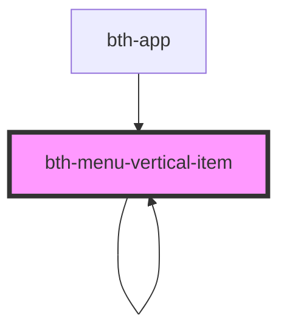

# menu-vertical-item

Item que representa uma opção do menu para navegação vertical

<!-- Auto Generated Below -->

## Properties

| Property               | Attribute                | Description                                                                                                                       | Type               | Default            |
| ---------------------- | ------------------------ | --------------------------------------------------------------------------------------------------------------------------------- | ------------------ | ------------------ |
| `ativo`                | `ativo`                  | Está ativo?                                                                                                                       | `boolean`          | `undefined`        |
| `contador`             | `contador`               | Valor que será exibido em uma "badge" próximo ao menu                                                                             | `number`           | `undefined`        |
| `descricao`            | `descricao`              | Descrição                                                                                                                         | `string`           | `undefined`        |
| `icone`                | `icone`                  | Ícone conforme biblioteca `"Material Design Icons"`                                                                               | `string`           | `undefined`        |
| `identificador`        | `identificador`          | Identificador                                                                                                                     | `number \| string` | `undefined`        |
| `identificadorPai`     | `identificador-pai`      | Identificador do menu agrupador "pai"                                                                                             | `number \| string` | `undefined`        |
| `menuLateralRecolhido` | `menu-lateral-recolhido` | O menu principal está recolhido?  Este parâmetro influência no formato como alguns elementos são exibidos, ex: badge do contador. | `boolean`          | `undefined`        |
| `possuiBadgeIcone`     | `possui-badge-icone`     | Indica se deve aparecer um badge no ícone.                                                                                        | `boolean`          | `undefined`        |
| `possuiPermissao`      | `possui-permissao`       | Possui permissão?                                                                                                                 | `boolean`          | `PERMISSAO_PADRAO` |
| `recolhido`            | `recolhido`              | Está recolhido?                                                                                                                   | `boolean`          | `undefined`        |
| `submenu`              | `submenu`                | É um submenu?                                                                                                                     | `boolean`          | `undefined`        |
| `submenus`             | --                       | Possui submenus?                                                                                                                  | `OpcaoMenu[]`      | `undefined`        |

## Events

| Event                     | Description                           | Type                                        |
| ------------------------- | ------------------------------------- | ------------------------------------------- |
| `menuVerticalSelecionado` | É emitido quando o menu é selecionado | `CustomEvent<MenuVerticalSelecionadoEvent>` |

## Dependencies

### Used by

 - [bth-app](..)
 - [bth-menu-vertical-item](.)

### Depends on

- [bth-icone](../../comuns/icone)
- [bth-menu-vertical-item](.)

### Graph

----------------------------------------------

Esta documentação é gerada automáticamente pelo StencilJS =)
