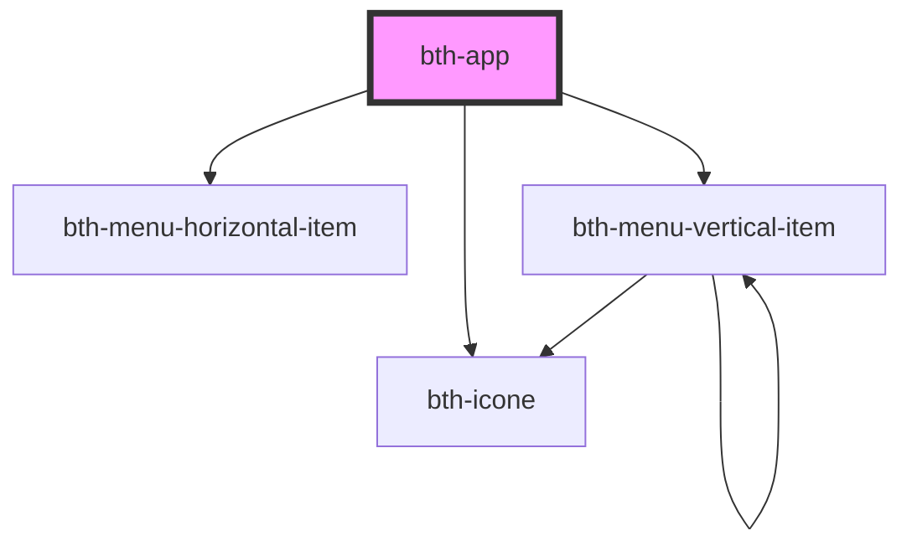

# bth-app

Este componente é o responsável por definir a estrutura e delimitar suas áreas, além de comportar opções de [navegação horizontal e vertical](#navegação).

## Configurando

### Áreas

A tag do componente é `<bth-app>` e através do atributo `slot` é possível direcionar conteúdo para determinadas áreas identificadas como: 

- **menu_marca_produto** Área de para logo da marca e nome do produto
- **menu_ferramentas** Área para componentes da barra de ferramentas
  - Os elementos atribuídos a este slot se organizam automaticamente para um formato diferente na versao mobile
- **container_contexto** Área para composição de uma barra de contexto _(desktop)_
  - Está disponível somente em resoluções desktop onde a largura é maior 991px
- **container_aplicacao** Área que abrigará a aplicação

```html
<!-- 
  "menu-bg-color": atributo opcional, se não informado o menu assume a cor de fundo padrão dos produtos Betha 
  "menu-vertical": atributo opcional, se não informado o menu assume o formato horizontal
-->
<bth-app menu-bg-color="#091420" menu-vertical>

  <!-- Menu produto -->
  <exemplo-elemento slot="menu_marca_produto"></exemplo-elemento>

  <!-- Menu ferramentas -->
  <exemplo-elemento slot="menu_ferramentas"></exemplo-elemento>
  <outro-exemplo-elemento slot="menu_ferramentas"></outro-exemplo-elemento>

  <!-- Contexto -->
  <exemplo-elemento slot="container_contexto"></exemplo-elemento>

  <!-- Aplicação -->
  <main slot="container_aplicacao"></main>

</bth-app>
```

> Nota: na área `menu_ferramentas` podemos atribuir múltiplos componentes

### Navegação

É possível configurar itens de navegação tanto **horizontal** ou **vertical**.

O roteamento é de responsabilidade da aplicação, através de JavaScript (framework/vanilla)

```js
var app = document.querySelector('bth-app');

app.addEventListener('opcaoMenuSelecionada', function navegar(event) {
  console.log('Navegando para', event.detail.rota, event.detail);
  app.setMenuAtivo(event.detail.id);
});

app.opcoes = [
  { id: 'visao-geral', descricao: 'Visão geral', icone: 'chart-pie', rota: '/visao-geral', possuiPermissao: true },
  {
    id: 'gerenciando', descricao: 'Gerenciando', icone: 'cog', possuiPermissao: true,
    submenus: [
      { id: 'liberando', descricao: 'Liberações', rota: '/liberando', possuiPermissao: true },
      { id: 'gerenciando', descricao: 'Pacotes de extensões', rota: '/gerenciando', possuiPermissao: true },
      { id: 'clientes-por-grupos', descricao: 'Grupos de clientes', rota: '/clientes-por-grupos', possuiPermissao: true },
      { id: 'clientes-por-extensoes', descricao: 'Clientes por extensão', rota: '/clientes-por-extensoes', possuiPermissao: true },
      { id: 'extensoes-por-clientes', descricao: 'Extensões por cliente', rota: '/extensoes-por-clientes', possuiPermissao: false }
    ]
  },
];

app.banner = {
  texto: 'Sua conexão com a internet está instável. Por isso, o sistema pode apresentar lentidão e prejudicar algumas atividades',
  tipo: 'warning',
  link: 'https://www.betha.com.br'
}
```

### Propriedades

As opções do menu podem ser configuradas através de algumas propriedades

- `id` **string | number** Identificador
- `descricao` **string** Descrição do item do menu
- `possuiPermissao` **boolean** Permite informar se o usuário possui ou não permissão de acesso _(opcional)_
- `rota` **string** Permite identificar qual a rota do item do menu _(opcional)_
- `icone` **string** Permite informar um ícone do [**Material Design Icons**](https://cdn.materialdesignicons.com/4.8.95/) da opção no menu vertical
  - Deve ser informado somente o ícone, não é necessário os prefixos _mdi mdi-_
- `submenus` **[]** Lista das opções acima como submenus
  - Esta opção está disponível somente para menu vertical

> Por padrão, ao utilizar o menu horizontal, caso o dispositivo acessado seja um dispositivo móvel, as opções serão transformadas em um menu vertical.

<!-- Auto Generated Below -->


## Properties

| Property       | Attribute       | Description                                                                                                             | Type          | Default     |
| -------------- | --------------- | ----------------------------------------------------------------------------------------------------------------------- | ------------- | ----------- |
| `banner`       | --              | Permite definir um banner que é exibido acima do menu                                                                   | `Banner`      | `undefined` |
| `menuBgColor`  | `menu-bg-color` | Permite customizar a cor de fundo da barra do menu. Por padrão segue a cor da linha dos produtos.                       | `string`      | `'#142c48'` |
| `menuVertical` | `menu-vertical` | Define se as opções do menu serão exibidas no formato "vertical", caso contrário serão exibidas no formato "horizontal" | `boolean`     | `false`     |
| `opcoes`       | --              | Opções de navegação do menu                                                                                             | `OpcaoMenu[]` | `[]`        |


## Events

| Event                  | Description                                                                       | Type                                     |
| ---------------------- | --------------------------------------------------------------------------------- | ---------------------------------------- |
| `bannerAlterado`       | É emitido quando o componente de menu possuir alterações na propriedade de banner | `CustomEvent<MenuBannerAlteradoEvent>`   |
| `opcaoMenuSelecionada` | É emitido quando alguma opção do menu for selecionada                             | `CustomEvent<OpcaoMenuSelecionadaEvent>` |


## Methods

### `setContadorMenu(identificador: IdentificadorOpcaoMenu, valor: number) => Promise<void>`

Define o valor do contador de um item do menu

#### Returns

Type: `Promise<void>`


### `setMenuAtivo(identificador: IdentificadorOpcaoMenu) => Promise<void>`

Define o estado de ativo para o menu do parâmetro

#### Returns

Type: `Promise<void>`


## Slots

| Slot                    | Description                                                                                                                |
| ----------------------- | -------------------------------------------------------------------------------------------------------------------------- |
| `"container_aplicacao"` | Área servindo como container para aplicação                                                                                |
| `"container_contexto"`  | Área do contexto logo abaixo do menu horizontal, permite compor componentes como a barra de contexto, ja pré estiliza <ul> |
| `"menu_ferramentas"`    | Área de ferramentas, fica na lateral direita do menu horizontal e geralmente comporta extensões da plataforma              |
| `"menu_marca_produto"`  | Área da marca e produto, precede o menu horizontal e geralmente contém a logo e nome do produto                            |


## CSS Custom Properties

| Name                      | Description                     |
| ------------------------- | ------------------------------- |
| `--bth-app-menu-bg-color` | Cor de fundo do menu horizontal |


## Dependencies

### Depends on

- [bth-icone](../comuns/icone)
- [bth-menu-horizontal-item](menu-horizontal-item)
- [bth-menu-vertical-item](menu-vertical-item)

### Graph


----------------------------------------------

Esta documentação é gerada automáticamente pelo StencilJS =)
