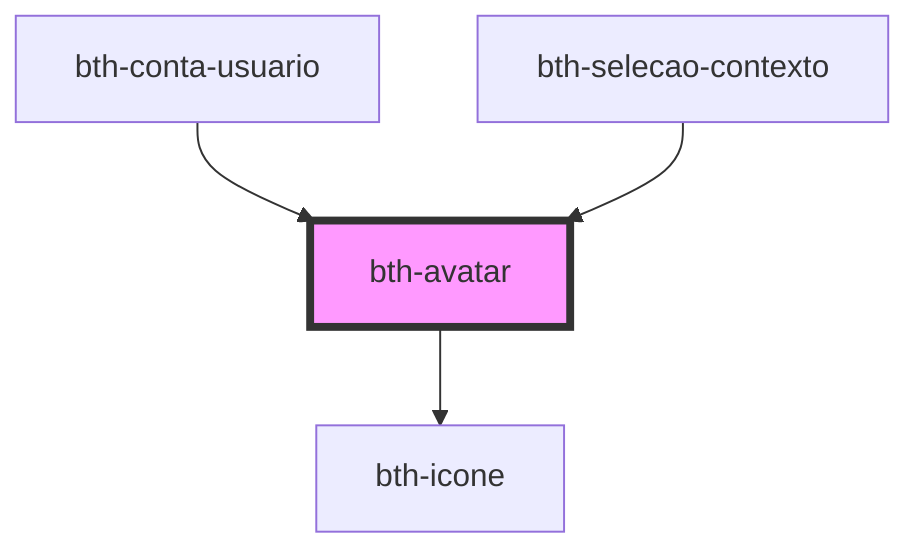

# bth-avatar

Este componente exibe um avatar

## HTML

A tag do componente é `<bth-avatar>`

```html
<!-- ... -->
<bth-avatar icone="cloud"></bth-avatar>
<bth-avatar src="https://placeimg.com/150/150/animals" titulo="Animais silvestres"></bth-avatar>

<bth-avatar iniciais="TX"></bth-avatar>
<bth-avatar iniciais="Prefeitura Municipal de Criciúma" sub-icone="lock" sub-icone-titulo="Licença bloqueada"></bth-avatar>
<bth-avatar iniciais="Palavras Compostas"></bth-avatar>
<!-- ... -->
```

## Configurando

A configuração pode ser feita via _markup_.

### Variacões Ícone

```html
<bth-avatar icone="cloud" tamanho="menor"></bth-avatar>
<bth-avatar icone="cloud" tamanho="pequeno" titulo="Título customizado"></bth-avatar>
<bth-avatar icone="cloud" sub-icone="cloud"></bth-avatar>
<bth-avatar icone="cloud" sub-icone="cloud"></bth-avatar>
<bth-avatar icone="cloud" tamanho="grande" borda borda-tamanho="2px" borda-cor="black"></bth-avatar>
<bth-avatar icone="cloud" tamanho="grande" quadrado></bth-avatar>
<bth-avatar icone="cloud" dimensao="150"></bth-avatar> <!-- tamanho customizado -->
```

### Variacões Imagem

```html
<bth-avatar src="https://placeimg.com/150/150/animals" tamanho="menor"></bth-avatar>
<bth-avatar src="https://placeimg.com/150/150/animals" tamanho="pequeno"></bth-avatar>
<bth-avatar src="https://placeimg.com/150/150/animals" titulo="How is cloud today?" sub-icone="cloud" sub-icone-titulo="Cloud status"></bth-avatar>
<bth-avatar src="https://placeimg.com/150/150/animals" borda borda-tamanho="2px" borda-cor="#7FAADC"></bth-avatar>
<bth-avatar src="https://placeimg.com/150/150/animals" tamanho="grande"></bth-avatar>
<bth-avatar src="https://placeimg.com/150/150/animals" tamanho="grande" quadrado></bth-avatar>
<bth-avatar src="https://placeimg.com/150/150/animals" tamanho="grande" quadrado borda borda-tamanho="2px" borda-cor="#7FAADC"></bth-avatar>
<bth-avatar src="https://placeimg.com/150/150/animals" dimensao="150"></bth-avatar> <!-- tamanho customizado -->
```

### Variacões para Texto com Iniciais

Caso seja passado até 2 caracteres serão exibidos exatamente os caracteres informados. Caso contrário, será computado a(s) letra(s) que possam melhor representar a(s) palavra(s)

```html
<bth-avatar iniciais="TX" tamanho="menor"></bth-avatar>
<bth-avatar iniciais="TX" tamanho="menor" dimensao="32"></bth-avatar> <!-- tamanho customizado -->
<bth-avatar iniciais="TX" tamanho="pequeno" titulo="Palavras Compostas"></bth-avatar>
<bth-avatar iniciais="TX"></bth-avatar> <!--  tamanho="medio" -->
<bth-avatar iniciais="TX" tamanho="grande"></bth-avatar>
<bth-avatar iniciais="TX" tamanho="grande" quadrado></bth-avatar>
<bth-avatar iniciais="TX" dimensao="150"></bth-avatar> <!-- tamanho customizado -->

<bth-avatar iniciais="Palavras Compostas" tamanho="menor"></bth-avatar>
<bth-avatar iniciais="Palavras Compostas" tamanho="pequeno"></bth-avatar>
<bth-avatar iniciais="Palavras Compostas"></bth-avatar> <!--  tamanho="medio" -->
<bth-avatar iniciais="Palavras Compostas" tamanho="grande"></bth-avatar>
<bth-avatar iniciais="Palavras Compostas" tamanho="grande" quadrado></bth-avatar>
```

<!-- Auto Generated Below -->


## Properties

| Property        | Attribute         | Description                                                                                                                                          | Type                                          | Default     |
| --------------- | ----------------- | ---------------------------------------------------------------------------------------------------------------------------------------------------- | --------------------------------------------- | ----------- |
| `borda`         | `borda`           | Define se o avatar possui borda                                                                                                                      | `boolean`                                     | `false`     |
| `bordaCor`      | `borda-cor`       | Define a cor da borda                                                                                                                                | `string`                                      | `'white'`   |
| `bordaRaio`     | `borda-raio`      | Define o raio da borda do avatar. Caso informado, sobrescreve o atributo utilitario 'quadrado'.                                                      | `string`                                      | `'50%'`     |
| `bordaTamanho`  | `borda-tamanho`   | Define o tamanho da borda                                                                                                                            | `string`                                      | `'1px'`     |
| `dimensao`      | `dimensao`        | Permite definir a dimensão (largura, altura) em px para o avatar                                                                                     | `number`                                      | `undefined` |
| `icone`         | `icone`           | Define um avatar de ícone conforme biblioteca `"Material Design Icons"`                                                                              | `string`                                      | `undefined` |
| `iniciais`      | `iniciais`        | Define avatar do tipo iniciais, aceitando até 3 iniciais ou computando as iniciais automaticamente conforme palavras passadas                        | `string`                                      | `undefined` |
| `quadrado`      | `quadrado`        | Define se o avatar terá suas bordas no formato quadrado.  Por padrão é redondo                                                                       | `boolean`                                     | `false`     |
| `src`           | `src`             | Define a fonte de um avatar de imagem. Aceita imagem e svg.                                                                                          | `string`                                      | `undefined` |
| `subIcone`      | `sub-icone`       | Define um sub-ícone conforme biblioteca `"Material Design Icons"`                                                                                    | `string`                                      | `undefined` |
| `subIconeTitle` | `sub-icone-title` | Define o "title" do subícone                                                                                                                         | `string`                                      | `''`        |
| `tamanho`       | `tamanho`         | Define o tamanho conforme dimensões pre-definidas para o avatar.  Opções disponíveis: menor (24x24), pequeno (28x28), medio (48x48) e grande (94x94) | `"grande" \| "medio" \| "menor" \| "pequeno"` | `'medio'`   |


## Events

| Event            | Description                                       | Type               |
| ---------------- | ------------------------------------------------- | ------------------ |
| `imageLoadError` | É emitido quando houver erro ao carregar a imagem | `CustomEvent<any>` |


## Dependencies

### Used by

 - [bth-conta-usuario](../../conta-usuario)
 - [bth-selecao-contexto](../selecao-contexto)

### Depends on

- [bth-icone](../icone)

### Graph


----------------------------------------------

Esta documentação é gerada automáticamente pelo StencilJS =)
