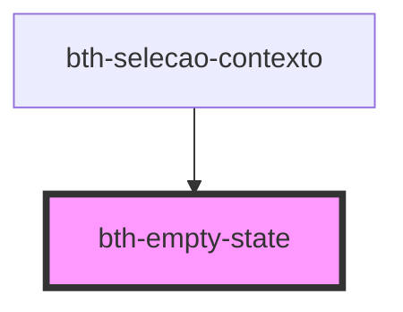

# bth-empty-state

Este componente exibe um _empty state_

## HTML

A tag do componente é `<bth-empty-state>`

```html
<!-- ... -->
<bth-empty-state show registros><bth-empty-state>
<!-- ... -->
```

## Configurando

A configuração pode ser feita via _markup_.

### HTML

O componente possui algumas variações, sendo elas informadas através de atributos booleanos.

```html
<bth-empty-state show registros></bth-empty-state>
<bth-empty-state show registros-pesquisa></bth-empty-state>
<bth-empty-state show online></bth-empty-state>
<bth-empty-state show offline></bth-empty-state>
<bth-empty-state show pagina-nao-encontrada></bth-empty-state>
```

- `show` Permite controlar se é exibido

Variações

- `registros` Define se o empty state é para registros
- `registros-pesquisa` Define se o empty state é para registros com pesquisa
- `online` Define se o empty state é para conexão online
- `offline` Define se o empty state é para conexão offline
- `pagina-nao-encontrada` Define se o empty state é para página não encontrada

<!-- Auto Generated Below -->


## Properties

| Property              | Attribute               | Description                                           | Type      | Default |
| --------------------- | ----------------------- | ----------------------------------------------------- | --------- | ------- |
| `offline`             | `offline`               | Define se o empty state é para conexão offline        | `boolean` | `false` |
| `online`              | `online`                | Define se o empty state é para conexão online         | `boolean` | `false` |
| `paginaNaoEncontrada` | `pagina-nao-encontrada` | Define se o empty state é para página não encontrada  | `boolean` | `false` |
| `pequeno`             | `pequeno`               | Define se o empty state é de tamanho pequeno          | `boolean` | `false` |
| `registros`           | `registros`             | Define se o empty state é para registros              | `boolean` | `false` |
| `registrosPesquisa`   | `registros-pesquisa`    | Define se o empty state é para registros com pesquisa | `boolean` | `false` |
| `show`                | `show`                  | Define se o empty state está visível                  | `boolean` | `false` |


## Dependencies

### Used by

 - [bth-selecao-contexto](../selecao-contexto)

### Graph


----------------------------------------------

Esta documentação é gerada automáticamente pelo StencilJS =)
