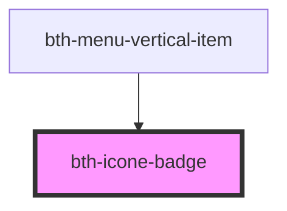

# bth-icon-badge

<!-- Auto Generated Below -->

## Properties

| Property     | Attribute     | Description                        | Type     | Default     |
| ------------ | ------------- | ---------------------------------- | -------- | ----------- |
| `badgeTitle` | `badge-title` | Title que deverá aparecer na badge | `string` | `undefined` |

## Dependencies

### Used by

 - [bth-menu-vertical-item](../../app/menu-vertical-item)

### Graph

----------------------------------------------

Esta documentação é gerada automáticamente pelo StencilJS =)
