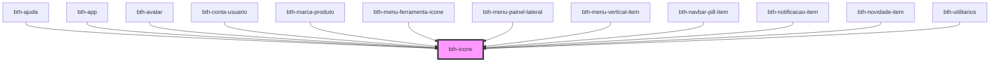

# bth-icone

Este componente exibe um ícone

> Atualmente suporta ícones do **Material Design Icons**

## HTML

A tag do componente é `<bth-icone>`

```html
<!-- ... -->
<bth-icone icone="cloud"></bth-icone>
<!-- ... -->
```

## Configurando

A configuração pode ser feita via _markup_.

### Variacões

```html
<bth-icone icone="cloud"></bth-icone>
<bth-icone icone="cloud" tamanho="25px" cor="#f7932f"></bth-icone>
<bth-icone icone="cloud" tamanho="2rem" cor="#df4661" titulo="Indica que o serviço contrato é Cloud"></bth-icone>
```

<!-- Auto Generated Below -->


## Properties

| Property             | Attribute    | Description                                                                                              | Type     | Default     |
| -------------------- | ------------ | -------------------------------------------------------------------------------------------------------- | -------- | ----------- |
| `ariaLabel`          | `aria-label` | Especifica o label a ser utilizado para acessibilidade. Por padrão irá assumir o nome do ícone.          | `string` | `undefined` |
| `cor`                | `cor`        | Cor de preenchimento, no mesmo formato do `"color"` em CSS. Por padrão irá herdar do contexto inserido.  | `string` | `'inherit'` |
| `icone` _(required)_ | `icone`      | Identificador do ícone conforme biblioteca `"Material Design Icons"`                                     | `string` | `undefined` |
| `tamanho`            | `tamanho`    | Tamanho em pixels, no mesmo formato do `"font-size"` em CSS. Por padrão irá herdar do contexto inserido. | `string` | `'inherit'` |


## Dependencies

### Used by

 - [bth-ajuda](../../ajuda)
 - [bth-app](../../app)
 - [bth-avatar](../avatar)
 - [bth-conta-usuario](../../conta-usuario)
 - [bth-marca-produto](../../marca-produto)
 - [bth-menu-ferramenta-icone](../../app/menu-ferramenta-icone)
 - [bth-menu-painel-lateral](../../app/menu-painel-lateral)
 - [bth-menu-vertical-item](../../app/menu-vertical-item)
 - [bth-navbar-pill-item](../navbar-pill/navbar-pill-item)
 - [bth-notificacao-item](../../notificacoes/notificacao-item)
 - [bth-novidade-item](../../novidades/novidade-item)
 - [bth-utilitarios](../../utilitarios)

### Graph


----------------------------------------------

Esta documentação é gerada automáticamente pelo StencilJS =)
