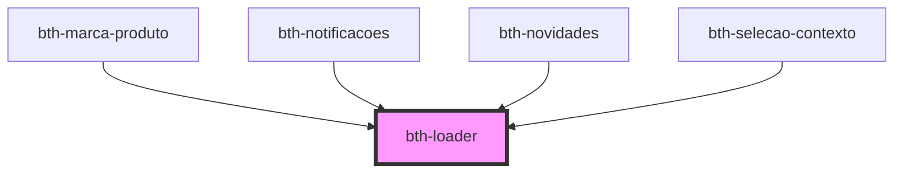

# bth-loader

Este componente exibe um _loader_

## HTML

A tag do componente é `<bth-loader>`

```html
<!-- ... -->
<bth-loader inline><bth-loader>
<!-- ... -->
```

## Variações

O componente possui duas variações, sendo uma centralizada ao centro do bloco e outra a inline, por padrão é centralizada.

```html
<bth-loader></bth-loader>
<bth-loader inline></bth-loader>
```

<!-- Auto Generated Below -->


## Properties

| Property | Attribute | Description                 | Type      | Default |
| -------- | --------- | --------------------------- | --------- | ------- |
| `inline` | `inline`  | Define se o loader é inline | `boolean` | `false` |


## Dependencies

### Used by

 - [bth-marca-produto](../../marca-produto)
 - [bth-notificacoes](../../notificacoes)
 - [bth-novidades](../../novidades)
 - [bth-selecao-contexto](../selecao-contexto)

### Graph


----------------------------------------------

Esta documentação é gerada automáticamente pelo StencilJS =)
