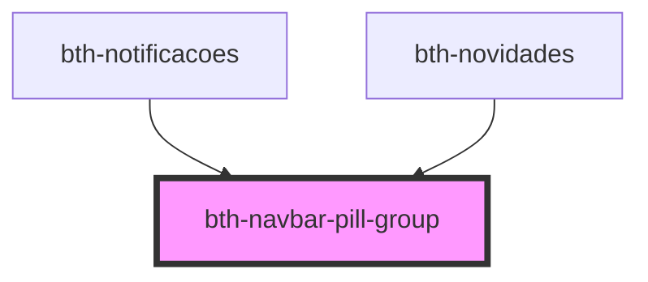

# bth-navbar-pill-group

<!-- Auto Generated Below -->

## Properties

| Property    | Attribute   | Description | Type     | Default     |
| ----------- | ----------- | ----------- | -------- | ----------- |
| `descricao` | `descricao` | Descrição   | `string` | `undefined` |

## Dependencies

### Used by

 - [bth-notificacoes](../../../notificacoes)
 - [bth-novidades](../../../novidades)

### Graph

----------------------------------------------

Esta documentação é gerada automáticamente pelo StencilJS =)
