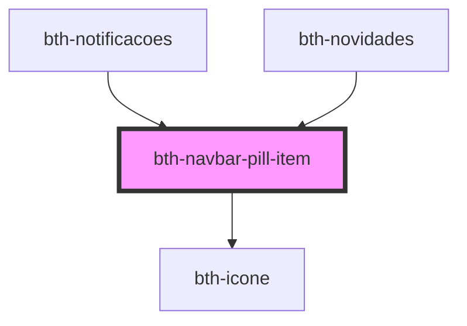

# bth-navbar-pill-item

<!-- Auto Generated Below -->

## Properties

| Property          | Attribute          | Description                                         | Type      | Default            |
| ----------------- | ------------------ | --------------------------------------------------- | --------- | ------------------ |
| `ativo`           | `ativo`            | Está ativo?                                         | `boolean` | `false`            |
| `descricao`       | `descricao`        | Descrição                                           | `string`  | `undefined`        |
| `icone`           | `icone`            | Ícone conforme biblioteca `"Material Design Icons"` | `string`  | `'cloud-question'` |
| `identificador`   | `identificador`    | Identificador. É enviado no evento de click.        | `any`     | `undefined`        |
| `showTotalizador` | `show-totalizador` | Exibir totalizador?                                 | `boolean` | `true`             |
| `totalizador`     | `totalizador`      | Totalizador                                         | `number`  | `0`                |

## Events

| Event                   | Description                   | Type               |
| ----------------------- | ----------------------------- | ------------------ |
| `navbarPillItemClicked` | É emitido ao clicar no filtro | `CustomEvent<any>` |

## Dependencies

### Used by

 - [bth-notificacoes](../../../notificacoes)
 - [bth-novidades](../../../novidades)

### Depends on

- [bth-icone](../../icone)

### Graph

----------------------------------------------

Esta documentação é gerada automáticamente pelo StencilJS =)
