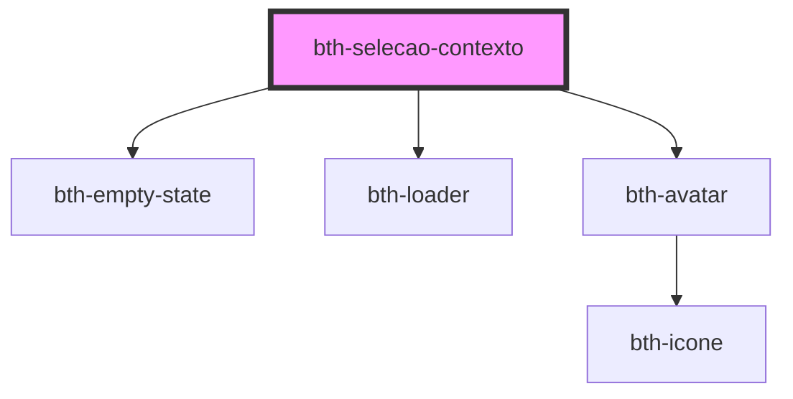

# bth-selecao-contexto

Este componente permite compor uma lista de seleção de contexto.

## Configurando

A tag do componente é `<bth-selecao-contexto>`

> ℹ️ Um atributo `id` pode ser utilizado para configurar múltiplos componentes em um mesmo documento HTML

> ℹ️ As propriedades configuradas via HTML também pode ser feitas através de JavaScript.

```html
<!-- ... -->
<bth-selecao-contexto id="selecao-contexto-entidades" placeholder-pesquisa="Qual entidade você está buscando?">
  
  <h4 slot="cabecalho">Selecione a entidade que deseja acessar</h4>

  
  
  <h4 slot="sem_resultado">Título customizado</h4>

  <span slot="sem_resultado">
    Parágrafo customizado com <a href="#" target="'_blank'">link também</a>
  </span>

  <div slot="rodape" style="text-align: right;">
    <a href="">Liberar nova entidade</a>
  </div>

<bth-selecao-contexto>
<!-- ... -->
```

```js
var itens = [
  { id: 1, descricao: 'Extensões', imagemAvatar: 'https://placeimg.com/48/48/tech' },
  { id: 2, descricao: 'Aplicações', icone: 'ship-wheel', complemento: 'Licença bloqueada', iconeStatus: 'lock', iconeStatusTitle: 'Licença bloqueada' },
  { id: 4, descricao: 'Plataforma', icone: 'medal' },
]

var selecaoContexto = document.querySelector('bth-selecao-contexto[id=selecao-contexto-entidades]');

selecaoContexto.buscar = function buscar() {
  return new Promise((resolve, reject) => {
    setTimeout(() => {
      resolve(itens)
    }, 1500);
  })
};

selecaoContexto.selecionar = function selecionar(item) {
  console.log('Selecionado entidade', item);
};
```

<!-- Auto Generated Below -->


## Properties

| Property              | Attribute              | Description                                        | Type                                                  | Default     |
| --------------------- | ---------------------- | -------------------------------------------------- | ----------------------------------------------------- | ----------- |
| `buscar`              | --                     | Método para buscar os itens de seleção             | `() => Promise<ItemSelecaoContexto[]>`                | `undefined` |
| `placeholderPesquisa` | `placeholder-pesquisa` | Placeholder para o input de pesquisa               | `string`                                              | `undefined` |
| `selecionar`          | --                     | Método executado ao selecionar algum item da lista | `(item: ItemSelecaoContexto) => void \| Promise<any>` | `undefined` |


## Slots

| Slot              | Description                                 |
| ----------------- | ------------------------------------------- |
| `"cabecalho"`     | Permite customizar o cabecalho              |
| `"rodape"`        | Permite customizar o rodape                 |
| `"sem_resultado"` | Permite customizar a área de sem resultados |


## Dependencies

### Depends on

- [bth-empty-state](../empty-state)
- [bth-loader](../loader)
- [bth-avatar](../avatar)

### Graph


----------------------------------------------

Esta documentação é gerada automáticamente pelo StencilJS =)
