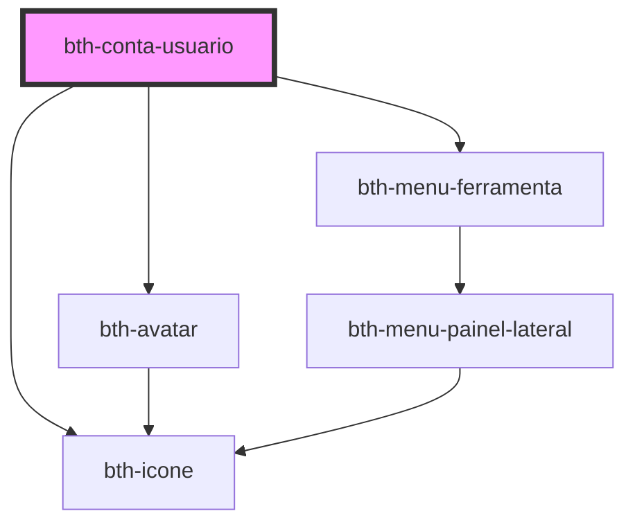

# bth-conta-usuario

Este componente exibe informações relacionadas ao usuário da conta logada.

Foi projetado para comportar a área de ferramentas, através do slot **menu_ferramentas**.

## Requisitos

### Variáveis

- Ter o `envs.js` sendo importado ou configurar as variáveis através do objeto de configuração.

## Configurando

A tag do componente é `<bth-conta-usuario>` e através do atributo `slot` é possível direcionar o componente para **menu_ferramentas**.

> ℹ️ As propriedades configuradas via HTML também pode ser feitas através de JavaScript.

```html
<bth-app>

  <!--
    Os atributos/propriedades abaixo podem ser customizados (por padrão obtém do env.js)
    > central-usuario-home="https://e-gov.betha.com.br/centraldousuario"
  -->
  <bth-conta-usuario
    slot="menu_ferramentas"
    usuario="lorem.ipsum"
    nome="Lorem Ipsum"
    foto-url="https://placeimg.com/80/80/animals">
  </bth-conta-usuario>
  <!-- ... -->

</bth-app>
```

```js
var contaUsuario = document.querySelector('bth-conta-usuario');

contaUsuario.addEventListener('logout', function logout() {
  console.debug('O usuário realizou a ação de logout no componente de conta do usuário');
});
```

<!-- Auto Generated Below -->


## Properties

| Property             | Attribute              | Description                                                           | Type     | Default     |
| -------------------- | ---------------------- | --------------------------------------------------------------------- | -------- | ----------- |
| `centralUsuarioHome` | `central-usuario-home` | URL para home da Central de Usuários. Por padrão irá obter do env.js. | `string` | `undefined` |
| `fotoUrl`            | `foto-url`             | URL para foto de avatar do usuário                                    | `string` | `undefined` |
| `nome`               | `nome`                 | Nome do usuário                                                       | `string` | `undefined` |
| `usuario`            | `usuario`              | Usuário ("username" ou "email")                                       | `string` | `undefined` |


## Events

| Event    | Description                            | Type                       |
| -------- | -------------------------------------- | -------------------------- |
| `logout` | É emitido ao clicar em Sair ("logout") | `CustomEvent<LogoutEvent>` |


## Dependencies

### Depends on

- [bth-avatar](../comuns/avatar)
- [bth-icone](../comuns/icone)
- [bth-menu-ferramenta](../app/menu-ferramenta)

### Graph


----------------------------------------------

Esta documentação é gerada automáticamente pelo StencilJS =)
