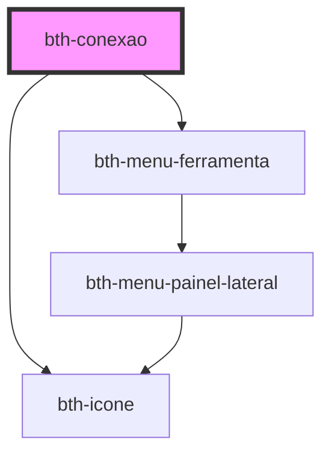

# bth-conexao

<!-- Auto Generated Below -->

## Events

| Event                | Description                                                               | Type                                   |
| -------------------- | ------------------------------------------------------------------------- | -------------------------------------- |
| `bannerAtualizado`   | É emitido para exibir o banner quando estiver sem conexão com a internet. | `CustomEvent<BannerAtualizadoEvent>`   |
| `conteudoSinalizado` | É emitido quando houver alteracões na conexão com a internet              | `CustomEvent<ConteudoSinalizadoEvent>` |

## Dependencies

### Depends on

- [bth-menu-ferramenta](../../app/menu-ferramenta)
- [bth-icone](../../comuns/icone)

### Graph

----------------------------------------------

Esta documentação é gerada automáticamente pelo StencilJS =)
