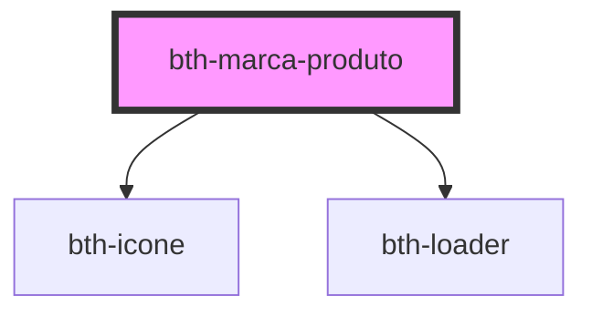

# bth-marca-produto

Este componente exibe a logo da Betha e o nome do produto.

Foi projetado para comportar a área do produto, através do slot **menu_marca_produto**.

## Requisitos

### Variáveis

- Ter o `envs.js` sendo importado ou configurar as variáveis através do objeto de configuração.

## Configurando

A tag do componente é `<bth-marca-produto>` e através do atributo `slot` é possível direcionar o componente para **menu_marca_produto**.

> ℹ️ As propriedades configuradas via HTML também pode ser feitas através de JavaScript.

```html
<bth-app>

  <!--
    Os atributos/propriedades abaixo podem ser customizados (por padrão obtém do env.js)
    > user-accounts-api="https://user-accounts.cloud.betha.com.br/v1.0/api"
    > suite-home="https://cloud.betha.com.br"
    > store-home="http://betha.store"
  -->
  <bth-marca-produto
    slot="menu_marca_produto"
    produto="Nome Produto"
    exibir-produtos>
  </bth-marca-produto>
  <!-- ... -->

</bth-app>
```

```js
function getAuthorization() {
  return {
    accessId: '5b56166d5bcb15010aa6aa96',
    accessToken: 'fbbbbffd-eeb4-4f7c-b222-8097e55e28fa',
    systemId: 78
  };
}

async function handleUnauthorizedAccess() {
  // Simula uma requisição para renovar o token
  return new Promise(function (resolve) {
    setTimeout(resolve, 3500);
  });
}

var authorization = {
  getAuthorization: getAuthorization,
  handleUnauthorizedAccess: handleUnauthorizedAccess,
}

var marcaProduto = document.querySelector('bth-marca-produto');
marcaProduto.authorization = authorization;
```

<!-- Auto Generated Below -->


## Properties

| Property               | Attribute           | Description                                                                                                            | Type                  | Default     |
| ---------------------- | ------------------- | ---------------------------------------------------------------------------------------------------------------------- | --------------------- | ----------- |
| `authorization`        | --                  | Configuração de autorização. É necessária para o componente poder se autentizar com os serviços.                       | `AuthorizationConfig` | `undefined` |
| `exibirProdutos`       | `exibir-produtos`   | Define se o componente exibirá os produtos, condicionando a busca. Caso informado `false` não irá buscar por produtos. | `boolean`             | `false`     |
| `produto` _(required)_ | `produto`           | Nome do produto                                                                                                        | `string`              | `undefined` |
| `storeHome`            | `store-home`        | URL para a home da betha store. Por padrão irá obter do env.js                                                         | `string`              | `undefined` |
| `suiteHome`            | `suite-home`        | URL para home da suite de usuários. Por padrão irá obter do env.js                                                     | `string`              | `undefined` |
| `userAccountsApi`      | `user-accounts-api` | URL para a API de user accounts. Por padrão irá obter do env.js                                                        | `string`              | `undefined` |


## Dependencies

### Depends on

- [bth-icone](../comuns/icone)
- [bth-loader](../comuns/loader)

### Graph


----------------------------------------------

Esta documentação é gerada automáticamente pelo StencilJS =)
