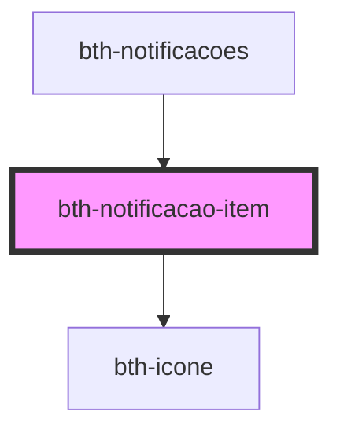

# bth-notificacao-item

<!-- Auto Generated Below -->

## Properties

| Property              | Attribute              | Description             | Type                                                                           | Default     |
| --------------------- | ---------------------- | ----------------------- | ------------------------------------------------------------------------------ | ----------- |
| `acompanharLink`      | --                     | Link acompanhar         | `NotificacaoLink`                                                              | `undefined` |
| `cancelamentoLink`    | --                     | Link cancelamento       | `NotificacaoLink`                                                              | `undefined` |
| `dataHora`            | `data-hora`            | Data e hora             | `number`                                                                       | `undefined` |
| `icone`               | `icone`                | Ícone                   | `string`                                                                       | `undefined` |
| `identificador`       | `identificador`        | Identificador           | `string`                                                                       | `undefined` |
| `origem`              | `origem`               | Origem                  | `string`                                                                       | `undefined` |
| `percentualProgresso` | `percentual-progresso` | Percentual do progresso | `number`                                                                       | `undefined` |
| `possuiProgresso`     | `possui-progresso`     | Possui progresso?       | `boolean`                                                                      | `undefined` |
| `prioridade`          | `prioridade`           | Prioridade              | `number`                                                                       | `undefined` |
| `resultadoLink`       | --                     | Link resultado          | `NotificacaoLink`                                                              | `undefined` |
| `status`              | `status`               | Status                  | `string`                                                                       | `undefined` |
| `texto`               | `texto`                | Texto                   | `string`                                                                       | `undefined` |
| `tipo`                | `tipo`                 | Tipo de notificação     | `TipoNotificacao.Lida \| TipoNotificacao.NaoLida \| TipoNotificacao.Progresso` | `undefined` |

## Events

| Event                | Description                                              | Type               |
| -------------------- | -------------------------------------------------------- | ------------------ |
| `notificacaoLida`    | É emitido quando uma notificação é marcada como lida     | `CustomEvent<any>` |
| `notificacaoNaoLida` | É emitido quando uma notificação é marcada como não lida | `CustomEvent<any>` |

## Dependencies

### Used by

 - [bth-notificacoes](..)

### Depends on

- [bth-icone](../../comuns/icone)

### Graph

----------------------------------------------

Esta documentação é gerada automáticamente pelo StencilJS =)
