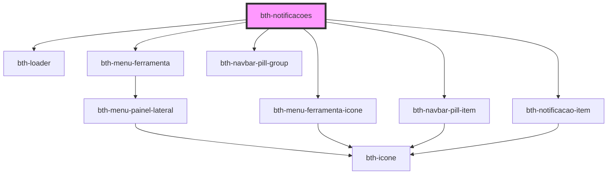

# bth-notificacoes

Este componente permite acesso as notificações da plataforma.

Foi projetado para comportar a área das ferramentas, através do slot **menu_ferramentas**.

## Requisitos

### Variáveis

- Ter o `envs.js` sendo importado ou configurar as variáveis através do objeto de configuração.

## Configurando

A tag do componente é `<bth-notificacoes>` e através do atributo `slot` é possível direcionar o componente para **menu_ferramentas**.

> ℹ️ As propriedades configuradas via HTML também pode ser feitas através de JavaScript.

```html
<bth-app>

  <!--
    Os atributos/propriedades abaixo podem ser customizados (por padrão obtém do env.js)
    > notificacoes-api="https://notifications.dev.bethacloud.com.br/notifications"
    > notificacoes-ws="wss://notifications.dev.bethacloud.com.br/notifications/v2/channel"
  -->
  <bth-notificacoes slot="menu_ferramentas"></bth-notificacoes>
  <!-- ... -->

</bth-app>
```

```js
function getAuthorization() {
  return {
    accessId: '5b56166d5bcb15010aa6aa96',
    accessToken: 'fbbbbffd-eeb4-4f7c-b222-8097e55e28fa',
    systemId: 78
  };
}

async function handleUnauthorizedAccess() {
  // Simula uma requisição para renovar o token
  return new Promise(function (resolve) {
    setTimeout(resolve, 3500);
  });
}

var authorization = {
  getAuthorization: getAuthorization,
  handleUnauthorizedAccess: handleUnauthorizedAccess,
}

var notificacoes = document.querySelector('bth-notificacoes');
notificacoes.authorization = authorization;

notificacoes.addEventListener('novaNotificacaoComLink', (data) => {
  console.log('Nova mensagem obtida no componente de notificações', data.detail);
});
```

<!-- Auto Generated Below -->


## Properties

| Property          | Attribute          | Description                                                                                            | Type                  | Default     |
| ----------------- | ------------------ | ------------------------------------------------------------------------------------------------------ | --------------------- | ----------- |
| `authorization`   | --                 | Configuração de autorização. É necessária para o componente poder realizar autentizar com os serviços. | `AuthorizationConfig` | `undefined` |
| `notificacoesApi` | `notificacoes-api` | URL para a api de notificações. Por padrão irá obter do env.js                                         | `string`              | `undefined` |
| `notificacoesWs`  | `notificacoes-ws`  | URL para o channel websocket de notificações. Por padrão irá obter do env.js                           | `string`              | `undefined` |


## Events

| Event                     | Description                                                                       | Type                                    |
| ------------------------- | --------------------------------------------------------------------------------- | --------------------------------------- |
| `conteudoSinalizado`      | É emitido quando houver notificações lidas ou não lidas a ser sinalizadas ao menu | `CustomEvent<ConteudoSinalizadoEvent>`  |
| `novaNotificacaoComLink`  | É emitido quando alguma notificação do tipo mensagem for recebida                 | `CustomEvent<NotificacaoComLinkEvent>`  |
| `novaNotificacaoRecebida` | É emitido quando alguma notificação for recebida                                  | `CustomEvent<NotificacaoRecebidaEvent>` |


## Dependencies

### Depends on

- [bth-loader](../comuns/loader)
- [bth-menu-ferramenta](../app/menu-ferramenta)
- [bth-menu-ferramenta-icone](../app/menu-ferramenta-icone)
- [bth-navbar-pill-group](../comuns/navbar-pill/navbar-pill-group)
- [bth-navbar-pill-item](../comuns/navbar-pill/navbar-pill-item)
- [bth-notificacao-item](notificacao-item)

### Graph


----------------------------------------------

Esta documentação é gerada automáticamente pelo StencilJS =)
