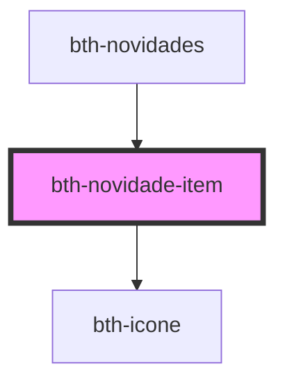

# bth-novidade-item

<!-- Auto Generated Below -->

## Properties

| Property        | Attribute       | Description                     | Type      | Default     |
| --------------- | --------------- | ------------------------------- | --------- | ----------- |
| `dataHora`      | `data-hora`     | Data e hora                     | `string`  | `undefined` |
| `identificador` | `identificador` | Identificador                   | `string`  | `undefined` |
| `isLida`        | `is-lida`       | Define se já está lida          | `boolean` | `false`     |
| `mensagem`      | `mensagem`      | Mensagem                        | `string`  | `undefined` |
| `titulo`        | `titulo`        | Título                          | `string`  | `undefined` |
| `url`           | `url`           | URL para obter mais informações | `string`  | `undefined` |

## Events

| Event             | Description                                           | Type                                |
| ----------------- | ----------------------------------------------------- | ----------------------------------- |
| `novidadeLida`    | É emitido quando uma novidade é marcada como lida     | `CustomEvent<NovidadeLeituraEvent>` |
| `novidadeNaoLida` | É emitido quando uma novidade é marcada como não lida | `CustomEvent<NovidadeLeituraEvent>` |

## Dependencies

### Used by

 - [bth-novidades](..)

### Depends on

- [bth-icone](../../comuns/icone)

### Graph

----------------------------------------------

Esta documentação é gerada automáticamente pelo StencilJS =)
