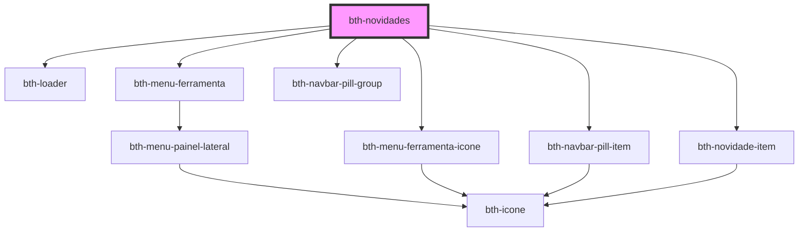

# bth-novidades

Este componente permite acesso as novidades da plataforma.

Foi projetado para comportar a área das ferramentas, através do slot **menu_ferramentas**.

## Requisitos

### Variáveis

- Ter o `envs.js` sendo importado ou configurar as variáveis através do objeto de configuração.

## Configurando

A tag do componente é `<bth-novidades>` e através do atributo `slot` é possível direcionar o componente para **menu_ferramentas**.

> ℹ️ As propriedades configuradas via HTML também pode ser feitas através de JavaScript.

```html
<bth-app>

  <!--
    Os atributos/propriedades abaixo podem ser customizados (por padrão obtém do env.js)
    > novidades-api="https://avisos.dev.bethacloud.com.br/api/v1"
  -->
  <bth-novidades slot="menu_ferramentas"></bth-novidades>
  <!-- ... -->

</bth-app>
```

```js
function getAuthorization() {
  return {
    accessId: '5b56166d5bcb15010aa6aa96',
    accessToken: 'fbbbbffd-eeb4-4f7c-b222-8097e55e28fa',
    userId: 'lorem.ipsum',
    systemId: 78
  };
}

async function handleUnauthorizedAccess() {
  // Simula uma requisição para renovar o token
  return new Promise(function (resolve) {
    setTimeout(resolve, 3500);
  });
}

var authorization = {
  getAuthorization: getAuthorization,
  handleUnauthorizedAccess: handleUnauthorizedAccess,
}

var novidades = document.querySelector('bth-novidades');
novidades.authorization = authorization;
```

<!-- Auto Generated Below -->


## Properties

| Property        | Attribute       | Description                                                                                            | Type                  | Default     |
| --------------- | --------------- | ------------------------------------------------------------------------------------------------------ | --------------------- | ----------- |
| `authorization` | --              | Configuração de autorização. É necessária para o componente poder realizar autentizar com os serviços. | `AuthorizationConfig` | `undefined` |
| `novidadesApi`  | `novidades-api` | URL para a api de novidades. Por padrão irá obter do env.js.                                           | `string`              | `undefined` |


## Events

| Event                | Description                                                                    | Type                                   |
| -------------------- | ------------------------------------------------------------------------------ | -------------------------------------- |
| `conteudoSinalizado` | É emitido quando houver novidades lidas ou não lidas a ser sinalizadas ao menu | `CustomEvent<ConteudoSinalizadoEvent>` |


## Dependencies

### Depends on

- [bth-loader](../comuns/loader)
- [bth-menu-ferramenta](../app/menu-ferramenta)
- [bth-menu-ferramenta-icone](../app/menu-ferramenta-icone)
- [bth-navbar-pill-group](../comuns/navbar-pill/navbar-pill-group)
- [bth-navbar-pill-item](../comuns/navbar-pill/navbar-pill-item)
- [bth-novidade-item](novidade-item)

### Graph


----------------------------------------------

Esta documentação é gerada automáticamente pelo StencilJS =)
