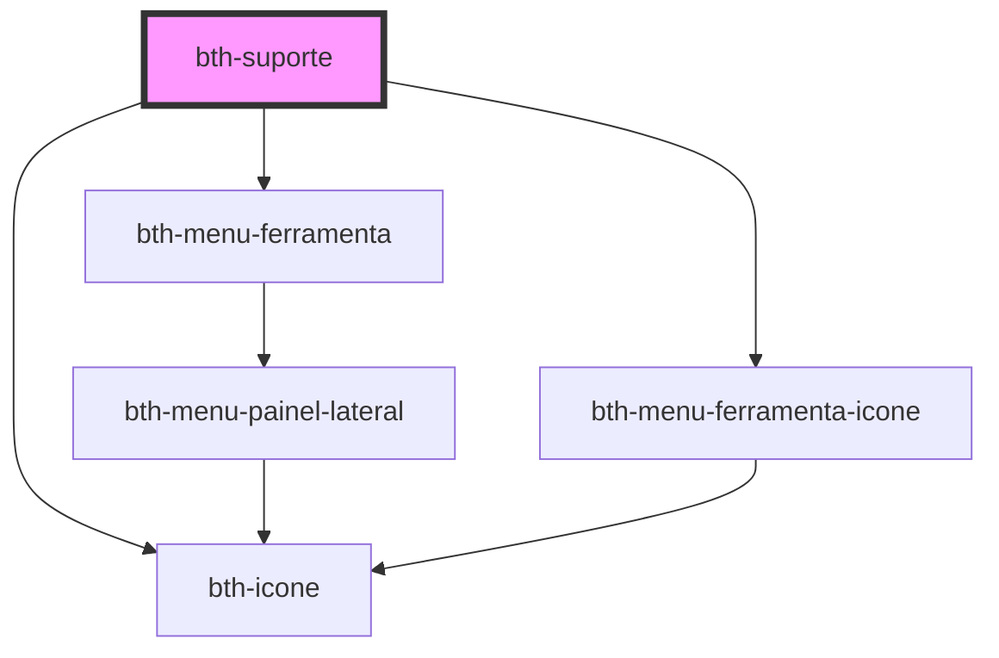

# bth-suporte

<!-- Auto Generated Below -->

## Properties

| Property                 | Attribute                    | Description                                                                                   | Type                  | Default     |
| ------------------------ | ---------------------------- | --------------------------------------------------------------------------------------------- | --------------------- | ----------- |
| `atendimento`            | `atendimento`                | Habilita ou desabilita o botão de abrir um chamado no atendimento                             | `boolean`             | `false`     |
| `authorization`          | --                           | Configuração de autorização. É necessária para o componente poder autenticar com os serviços. | `AuthorizationConfig` | `undefined` |
| `blipChat`               | `blip-chat`                  | Habilita ou desabilita o Blip Chat                                                            | `boolean`             | `false`     |
| `blipChatCustomStyle`    | `blip-chat-custom-style`     | Usar estilos que este componente fornece                                                      | `boolean`             | `false`     |
| `blipChatFabButtonColor` | `blip-chat-fab-button-color` | Cor do botão flutuante do Blip Chat                                                           | `string`              | `undefined` |
| `blipChatUserInfo`       | --                           | Usuário de sessão do Blip Chat                                                                | `BlipChatUserInfo`    | `undefined` |
| `centralAjudaHome`       | `central-ajuda-home`         | URL para a home da central de ajuda. Por padrão irá obter do env.js                           | `string`              | `undefined` |
| `fabButton`              | `fab-button`                 | Indica se a aplicação já possui botão flutuante                                               | `boolean`             | `false`     |
| `licencasApi`            | `licencas-api`               | URL para a api de licenças. Por padrão irá obter do env.js.                                   | `string`              | `undefined` |

## Methods

### `handleWindowMessage(data: any) => Promise<void>`

Método para testar recebimento de uma mensagem do window para definir o badge de mensagens não vistas,
através de um evento do tipo 'BLIP_WEBCHAT_NOTIFICATION' emitido pelo loader do Blip Chat

#### Returns

Type: `Promise<void>`

### `loadBlipChat() => Promise<void>`

Carrega o Blip Chat

#### Returns

Type: `Promise<void>`

## Dependencies

### Depends on

- [bth-menu-ferramenta](../app/menu-ferramenta)
- [bth-menu-ferramenta-icone](../app/menu-ferramenta-icone)
- [bth-icone](../comuns/icone)

### Graph

----------------------------------------------

Esta documentação é gerada automáticamente pelo StencilJS =)
