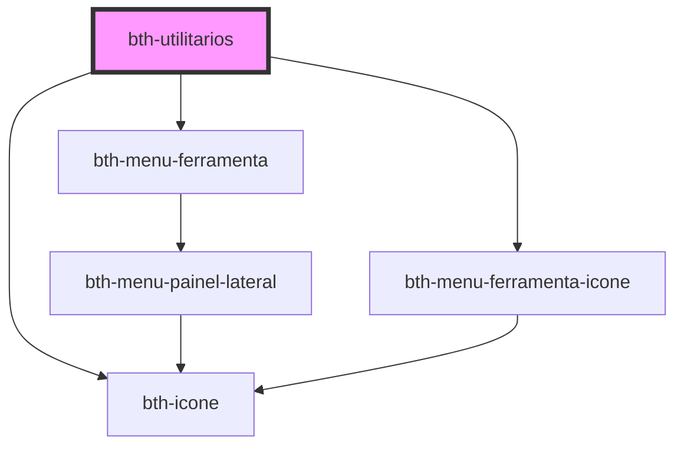

# bth-utilitarios

Este componente permite acessar uma lista de utilitários.

Foi projetado para comportar a área das ferramentas, através do slot **menu_ferramentas**.

## Configurando

A tag do componente é `<bth-utilitarios>` e através do atributo `slot` é possível direcionar o componente para **menu_ferramentas**.

```html
<bth-app>

  <!-- ... -->
  <bth-utilitarios slot="menu_ferramentas"><bth-utilitarios>
  <!-- ... -->

</bth-app>
```

```js
var utilitarios = document.querySelector('bth-utilitarios');

utilitarios.utilitarios = [
  { nome: 'Autorizações', rota: '/liberando', icone: 'key', possuiPermissao: true, },
  { nome: 'Gerenciador de Acessos', rota: '/gerenciando', icone: 'key-variant', possuiPermissao: true, },
  { nome: 'Lorem ipsum, dolor sit amet consectetur adipisicing elit', rota: '/', icone: 'merge', possuiPermissao: true, },
  { nome: 'Restrito', rota: '/', icone: 'atom-variant', possuiPermissao: false },
  { nome: 'Console AWS', rota: 'https://aws.amazon.com/pt/console/', icone: 'amazon', possuiPermissao: true }
];

utilitarios.addEventListener('opcaoUtilitarioSelecionada', function navegar(event) {
  if (isUrl(event.detail.rota)) {
    window.open(event.detail.rota, '_blank')
    return;
  }

  console.log('Navegando para', event.detail.rota);
});
```

<!-- Auto Generated Below -->


## Properties

| Property      | Attribute | Description | Type           | Default     |
| ------------- | --------- | ----------- | -------------- | ----------- |
| `utilitarios` | --        | Utilitarios | `Utilitario[]` | `undefined` |


## Events

| Event                        | Description                                       | Type                                           |
| ---------------------------- | ------------------------------------------------- | ---------------------------------------------- |
| `opcaoUtilitarioSelecionada` | É emitido quando algum utilitário for selecionado | `CustomEvent<OpcaoUtilitarioSelecionadaEvent>` |


## Dependencies

### Depends on

- [bth-menu-ferramenta](../app/menu-ferramenta)
- [bth-menu-ferramenta-icone](../app/menu-ferramenta-icone)
- [bth-icone](../comuns/icone)

### Graph


----------------------------------------------

Esta documentação é gerada automáticamente pelo StencilJS =)
