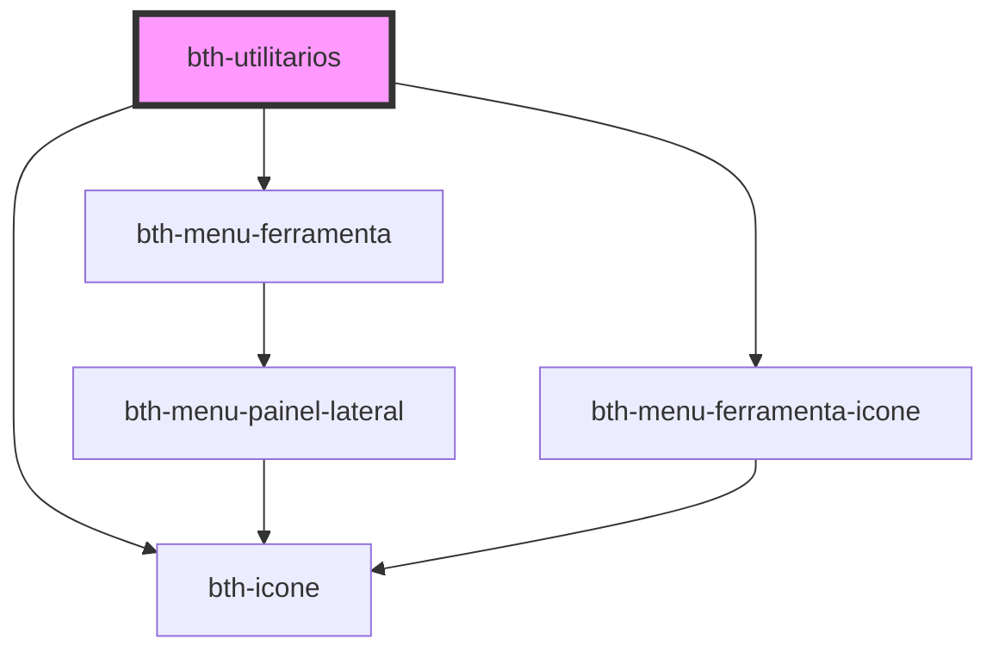

# bth-utilitarios

Este componente permite acessar uma lista de utilitários.

Foi projetado para comportar a área das ferramentas, através do slot **menu_ferramentas**.

## Configurando

A tag do componente é `<bth-utilitarios>` e através do atributo `slot` é possível direcionar o componente para **menu_ferramentas**.

```html
<bth-app>

  <!-- ... -->
  <bth-utilitarios slot="menu_ferramentas"><bth-utilitarios>
  <!-- ... -->

</bth-app>
```

```js
var utilitarios = document.querySelector('bth-utilitarios');

utilitarios.utilitarios = [
  { nome: 'Autorizações', rota: '/liberando', icone: 'key', possuiPermissao: true, },
  { nome: 'Gerenciador de Acessos', rota: '/gerenciando', icone: 'key-variant', possuiPermissao: true, },
  { nome: 'Lorem ipsum, dolor sit amet consectetur adipisicing elit', rota: '/', icone: 'merge', possuiPermissao: true, },
  { nome: 'Restrito', rota: '/', icone: 'atom-variant', possuiPermissao: false },
  { nome: 'Console AWS', rota: 'https://aws.amazon.com/pt/console/', icone: 'amazon', possuiPermissao: true }
];

utilitarios.addEventListener('opcaoUtilitarioSelecionada', function navegar(event) {
  if (isUrl(event.detail.rota)) {
    window.open(event.detail.rota, '_blank')
    return;
  }

  console.log('Navegando para', event.detail.rota);
});
```

## Buscando utilitários centrais (api-utilitarios)

Além dos utilitários definidos pelo próprio sistema (prop `utilitarios`), o componente pode
buscar os **utilitários centrais** cadastrados na `api-utilitarios`
visíveis para a identidade do usuário e **concatená-los** à lista do sistema (dedup por `rota`,
os do sistema têm precedência).

A busca é **opt-in** pela flag `buscar-utilitarios` (desligada por padrão — sem ela o
comportamento é idêntico ao legado). Quando ligada, exige `authorization`. O host é resolvido por
ambiente (test/prod) a partir do `variaveis.js` da aplicação
(`___bth.envs.suite.utilitarios.v1.host`); pode ser sobrescrito pelo prop `utilitarios-host`.

Se a chamada falhar, o componente faz **fail-open**: renderiza apenas os utilitários do sistema.

```js
var utilitarios = document.querySelector('bth-utilitarios');

utilitarios.utilitarios = [ /* utilitários hardcoded do sistema */ ];

// habilita a busca central; host vem do variaveis.js, salvo override
utilitarios.buscarUtilitarios = true;
utilitarios.authorization = authorizationConfig; // { getAuthorization(), handleUnauthorizedAccess() }
// utilitarios.utilitariosHost = 'https://utilitarios.test.betha.cloud'; // opcional (override)
```

<!-- Auto Generated Below -->


## Properties

| Property            | Attribute            | Description                                                                                                                                                                                                                    | Type                  | Default     |
| ------------------- | -------------------- | ------------------------------------------------------------------------------------------------------------------------------------------------------------------------------------------------------------------------------ | --------------------- | ----------- |
| `authorization`     | --                   | Configuração de autorização. Obrigatória quando `buscarUtilitarios` está habilitada (a api-utilitarios filtra a visibilidade pela identidade do token + User-Access).                                                          | `AuthorizationConfig` | `undefined` |
| `buscarUtilitarios` | `buscar-utilitarios` | Habilita a busca dos utilitários centrais (api-utilitarios) visíveis ao usuário, concatenando-os aos definidos pelo sistema. Desligada por padrão: sem ela o componente apenas renderiza `utilitarios` (comportamento legado). | `boolean`             | `false`     |
| `utilitarios`       | --                   | Utilitários definidos pelo próprio sistema. São sempre exibidos, independente da busca central.                                                                                                                                | `Utilitario[]`        | `undefined` |
| `utilitariosHost`   | `utilitarios-host`   | Override do host da api-utilitarios. Por padrão é resolvido por ambiente (test, prod) a partir do `variaveis.js` da aplicação (`___bth.envs.suite.utilitarios.v1.host`).                                                       | `string`              | `undefined` |


## Events

| Event                        | Description                                       | Type                                           |
| ---------------------------- | ------------------------------------------------- | ---------------------------------------------- |
| `opcaoUtilitarioSelecionada` | É emitido quando algum utilitário for selecionado | `CustomEvent<OpcaoUtilitarioSelecionadaEvent>` |


## Dependencies

### Depends on

- [bth-menu-ferramenta](../app/menu-ferramenta)
- [bth-menu-ferramenta-icone](../app/menu-ferramenta-icone)
- [bth-icone](../comuns/icone)

### Graph

```mermaid
graph TD;
  bth-utilitarios --> bth-menu-ferramenta
  bth-utilitarios --> bth-menu-ferramenta-icone
  bth-utilitarios --> bth-icone
  bth-menu-ferramenta --> bth-menu-painel-lateral
  bth-menu-painel-lateral --> bth-icone
  bth-menu-ferramenta-icone --> bth-icone
  style bth-utilitarios fill:#f9f,stroke:#333,stroke-width:4px
```

----------------------------------------------

Esta documentação é gerada automáticamente pelo StencilJS =)
